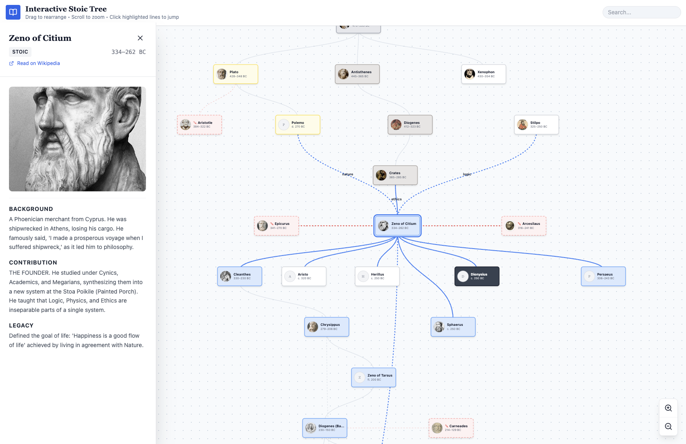
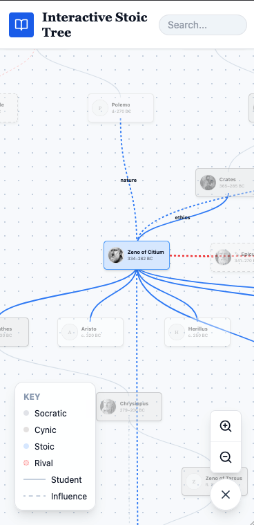

# Interactive Stoic
> **Note**  This project was made just for fun, feel free to use, remix, or share it as you like!


**Interactive Stoic** is an interactive web-based visualization tool that maps the genealogy and intellectual network of Stoic philosophy. It explores the connections between ancient philosophers, their schools (Stoicism, Cynicism, Academy, etc.), and their historical relationships (Teacher, Student, Rival, Influence).

## Demo

<p align="center">
  
  
</p>

## Features

-   **Interactive Force-Directed Graph**: Navigate a dynamic network of philosophers arranged by generation.
-   **Detailed Profiles**: Click on any node to view detailed biographical information, contributions, and legacy.
-   **Contextual Relationships**: Visualizes different types of connections:
    -   **Influence**: Dashed lines showing intellectual debt.
    -   **Rivalry**: distinct red lines connecting philosophical opponents.
    -   **Lineage**: Solid lines tracing teacher-student succession.
-   **Dynamic Zoom & Focus**:
    -   **Smart Zoom**: clicking a node automatically zooms and pans to fit the node and all its connected peers/influences on screen.
    -   **Cursor-Based Zoom**: smooth zooming towards your mouse pointer.
-   **Search**: Instantly locate specific philosophers.
-   **External Resources**: Direct links to Wikipedia for deeper reading.

## Tech Stack

-   **React**: UI and component management.
-   **Vite**: Fast build tool and development server.
-   **Tailwind CSS**: Styling and layout.
-   **Lucide React**: Iconography.
-   **Custom Force Layout**: A specialized physics engine hook for generation-based graph organization.

## Getting Started

### Live Demo
Check out the live webpage here [https://samxu29.github.io/interactive_stoic/](https://samxu29.github.io/interactive_stoic/)

### Local Development

1.  **Install Dependencies**:
    ```bash
    npm install
    ```

2.  **Run Development Server**:
    ```bash
    npm run dev
    ```

3.  **Open in Browser**:
    Navigate to the URL shown in the terminal (usually `http://localhost:5173`).

